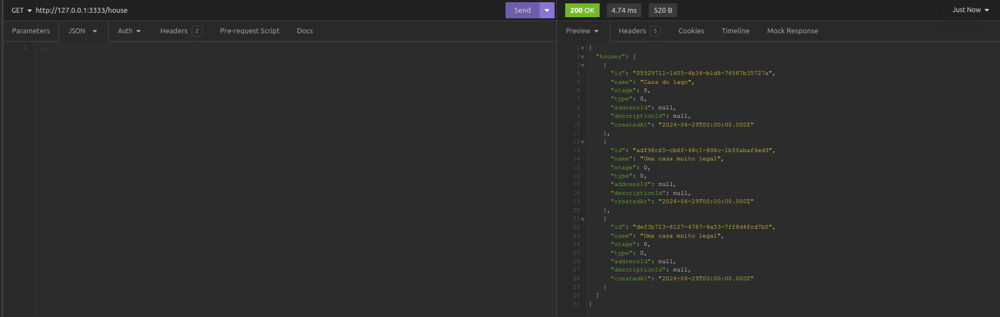
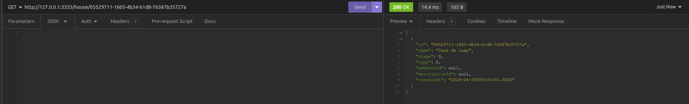
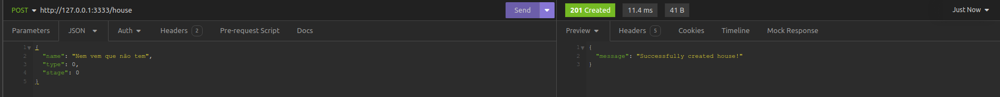
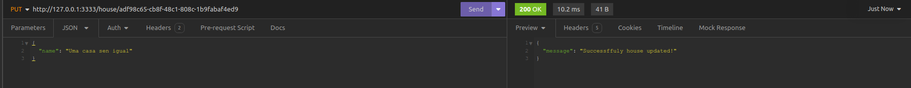
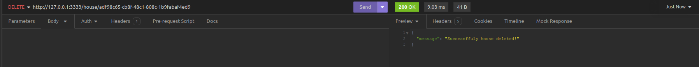

# Imobiliary Server

## Clone Repository

To use the repository, clone the repository using:
```bash
# With HTTPS
git clone https://github.com/Advanzzzze/back-end.git

# With SSH
git clone git@github.com:Advanzzzze/back-end.git

# Or with GitHub CLI
gh repo clone Advanzzzze/back-end
```

## Install all dependencies
```bash
cd back-end
npm install
```

## Node Version

To run this project, your node version must be 20.12.0+. Caso você esteja em uma versão anterior, execute os seguintes passos:

1. Make sure you have version 20.12.0+ installed by running:
```bash
nvm list
```

2. If not, run:
```bash
nvm install lts
nvm use
```

3. If you already have version 20.12.0+ installed, just run:
```bash
nvm use
```

## Run ther server and other commands

1. With Node Package Manager (NPM):
  - `npm run start:dev`: It will run the local server, but without uploading the database to Docker
  - `npm run start`: It will run tge build server, but without uploading the database to Docker
  - `npm run lint`: Will check all linting errors
  - `npm run lint:fix`: Will check and fix all linting errors
  - `npm run build`: It will generate the project production files
  - `npm run test`: Will run unit tests
  - `npm run test:watch`: Will run unit tests and the tests will run whenever a file is saved
  - `npm run test:ui`: It will run the unit tests and open a graphical interface detailing the unit tests
  - `npm run test:coverage`: It will generate a report for unit tests
  - `npm run drizzle-studio`: It will open a drizzle bank manager
2. With Make commands:
  - `make api`: It will upload the database and run the server
  - `make migrations`: It will create the migrations and run them in the bank
  - `make migrations-generate`: It will generate migrations without running them in the database
  - `make migrations-execute`: It will run the existing migrations in the bank
  - `make db-create`: It will upload the database
  - `make db-destroy`: It will kill the database
  - `make run-server`: It will run the server without uploading the database
  - `make studio`: It will open a drizzle bank manager

O.B.S.: Whenever the database is started, a database management platform called
Adminer (formerly phpMyAdmin) will automatically start in http://localhost:8080, making it an alternative
to Drizzle Studio

## Routes and use cases

|   HTTP verb   |     Route        |  Use Case description                      |  Has body  | Body value        |
| ------------- | ---------------- | ------------------------------------------ | ---------- | ----------------- |
| GET           | :3333/house      | Get all houses in the database             | false      | ***************** |
| GET           | :3333/house/:id  | Get just the house with the correct id     | false      | ***************** |
| POST          | :3333/house      | Create a house                             | true       | name, stage, type |
| UPDATE        | :3333/house/:id  | Update some house data with the correct id | false      | ***************** |
| DELETE        | :3333/house/:id  | Delete some house with the correct id      | false      | ***************** |

## API Examples

### House Routes

1. GET - :3333/house


2. GET - :3333/house/:id


3. POST - :3333/house


4. PUT - :3333/house/:id


5. DELETE - :3333/house/:id


### Address Routes

### Descriptions Routes

## Technologies


